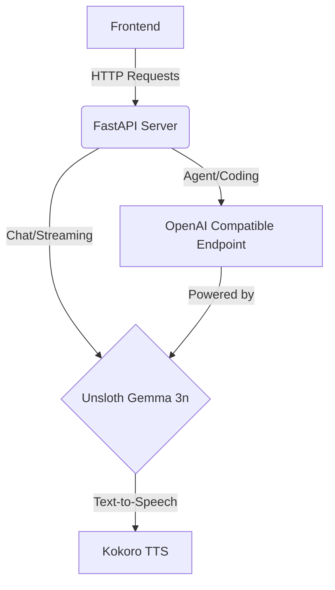
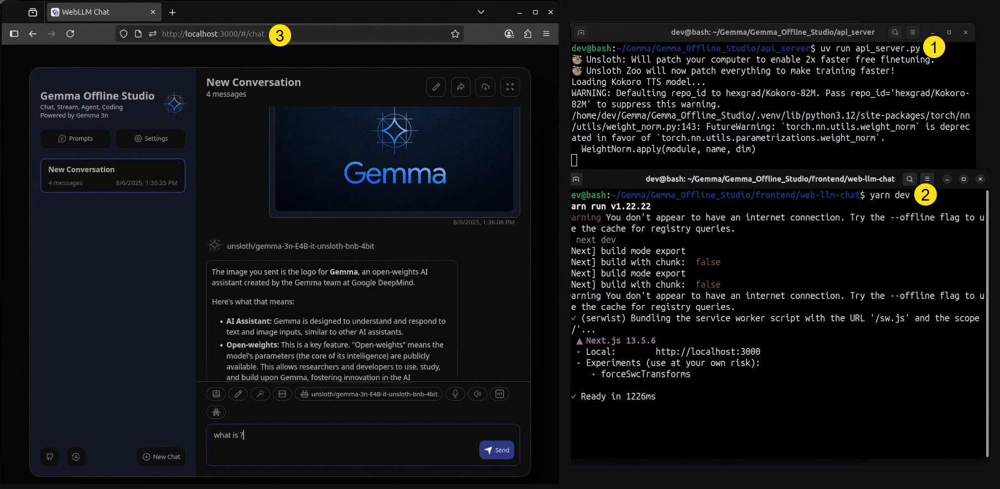
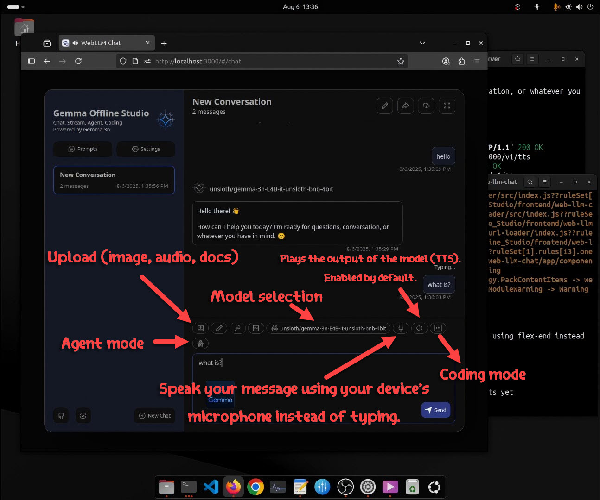
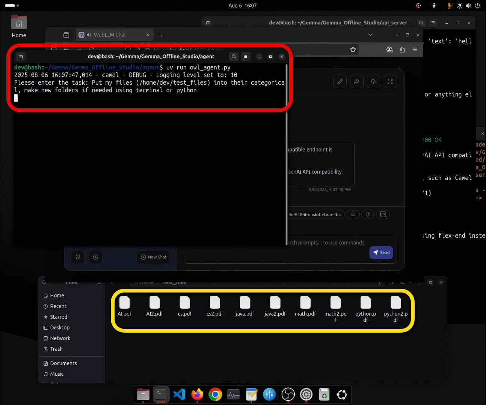
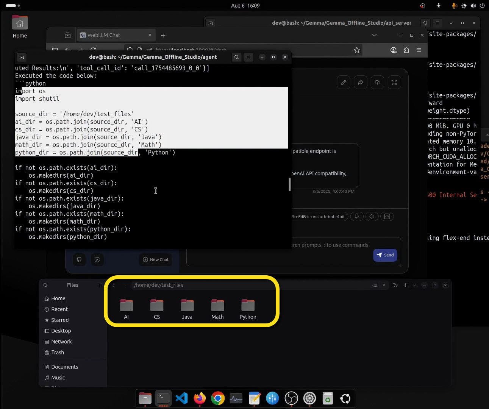
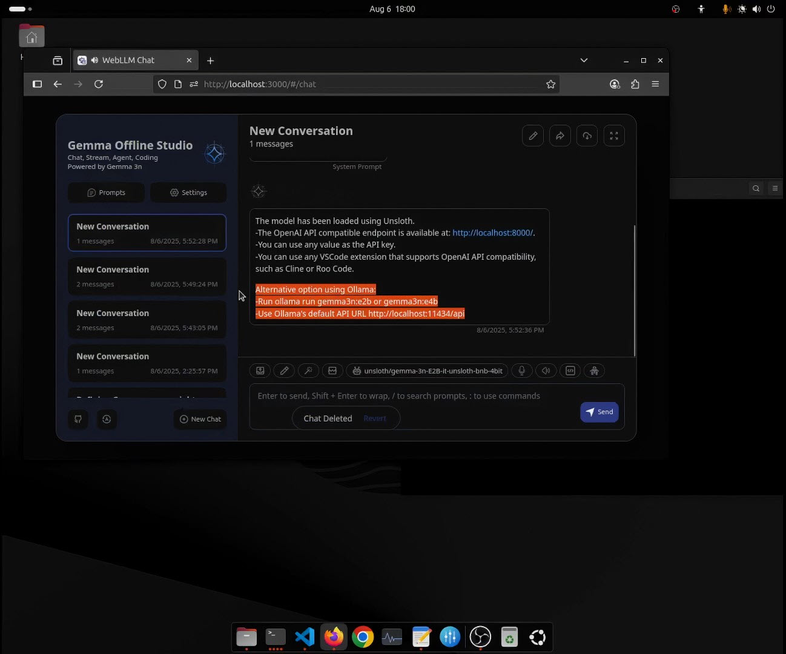
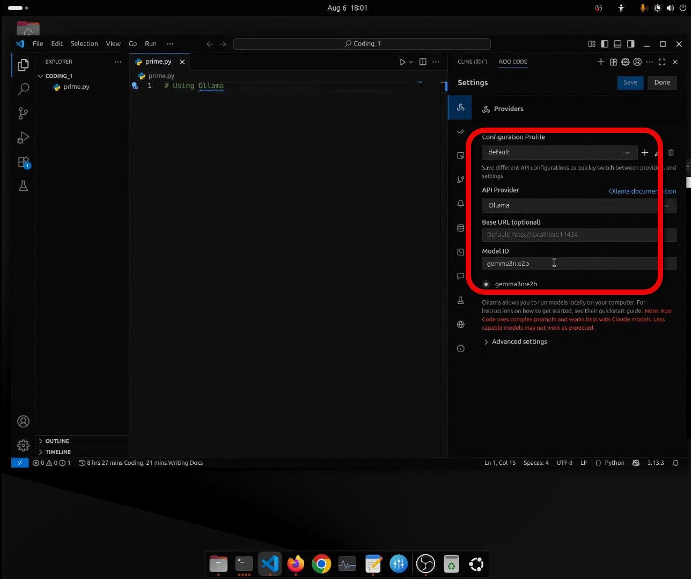
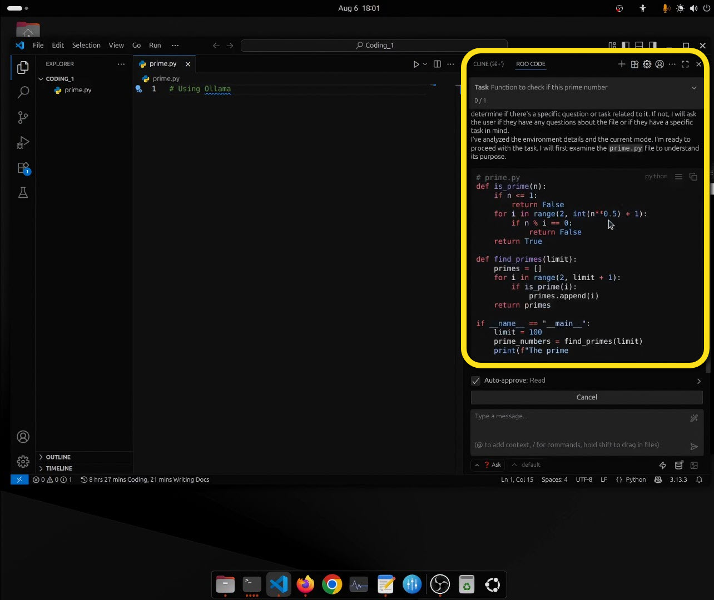

# Gemma Offline Studio

**Inspired by Google's AI Studio, this project provides a single platform for offline Chatting, streaming, agent tasks, and coding powered by Gemma 3n**

---

## Introduction & Use Cases

<!-- [](https://youtu.be/s9lmQqs0jXY) -->

<a href="https://youtu.be/s9lmQqs0jXY" target="_blank">
  
</a>

---

## Architecture

The application is built with the following architecture:



The application utilizes [unsloth/gemma-3n-E4B-it-unsloth-bnb-4bit](https://huggingface.co/unsloth/gemma-3n-E4B-it-unsloth-bnb-4bit) and [unsloth/gemma-3n-E2B-it-unsloth-bnb-4bit](https://huggingface.co/unsloth/gemma-3n-E2B-it-unsloth-bnb-4bit).

**Workflow:**

1.  **Chatting & Streaming:** The frontend sends requests directly to the FastAPI server, which leverages the Gemma 3n model. The text output can be converted to speech using Kokoro TTS.
2.  **Agent & Coding:** The agent and coding API server provides an OpenAI-compatible endpoint at `http://localhost:8000/`.
    * You can use this with any app that supports OpenAI API compatibility, such as Cline, RooCode, and Camel-AI Owl Agent.
    * Use any value as the API key.


**Note:** While you can use Ollama instead of unsloth, as of August 2025, it only supports text generation. For more details, refer to the [Ollama Gemma3n library](https://ollama.com/library/gemma3n).

---

## System Requirements

The following are the observed GPU memory requirements with low length context, based on testing:

**On Ubuntu:**

*   **unsloth/gemma-3n-E2B-it-unsloth-bnb-4bit:** 9 GB VRAM
*   **unsloth/gemma-3n-E4B-it-unsloth-bnb-4bit:** 11 GB VRAM

*   **ollam run gemma3n:e2b:** 6 GB VRAM
*   **ollam run gemma3n:e4b:** 8 GB VRAM

**On Google Colab:**

*   **unsloth/gemma-3n-E2B-it-unsloth-bnb-4bit:** 8 GB VRAM
*   **unsloth/gemma-3n-E4B-it-unsloth-bnb-4bit:** 10 GB VRAM
*   **ollam run gemma3n:e2b:** 5.5 GB VRAM
*   **ollam run gemma3n:e4b:** 7.5 GB VRAM

It is recommended to have an NVIDIA GPU with at least **12 GB of VRAM** for optimal performance.

---

# Setup & Running Instructions (Tested on Ubuntu)

## Setup Instructions

1.  **Make sure you have Python, Git, and Node.js installed before you start.**

2.  **Clone the repository:**
    ```bash
    git clone https://github.com/7Gamil/Gemma-Offline-Studio.git && cd Gemma-Offline-Studio
    ```


3.  **Install `uv` using one of the methods below:**
    *   **Standalone Installer (Recommended):**
        ```bash
        curl -Ls https://astral.sh/uv/install.sh | sh
        ```
    *   **pipx:**
        ```bash
        pipx install uv
        ```
    *   **PyPI (Not Recommended):**
        ```bash
        pip install uv
        ```

4.  **Install python dependencies:**
    ```bash
    uv sync
    ```

5.  **Install Node.js dependencies:**
    ```bash
    cd frontend/ && yarn install
    ```

---

## Running the Application

1.  **Start the API server:**
    ```bash
    uv run api-server/api-server.py
    ```

2.  **Start the frontend:**
    ```bash
    cd frontend/ && yarn dev
    ```

3.  **Open your browser and navigate to `http://localhost:3000`**

*Note: The first run will download the model, which may take some time.*



---

## How to use.



## How to use


## Agent
Camel-AI OWL ready to use with gemma offline studio
```bash
uv run agent/owl_agent.py
```
Write the task, e.g.

```bash
Put my files {path} into their categorical, make new folders if needed using terminal or python
```


The result


## Coding
Roo code extension in vscode using ollama to run gemma 3n


